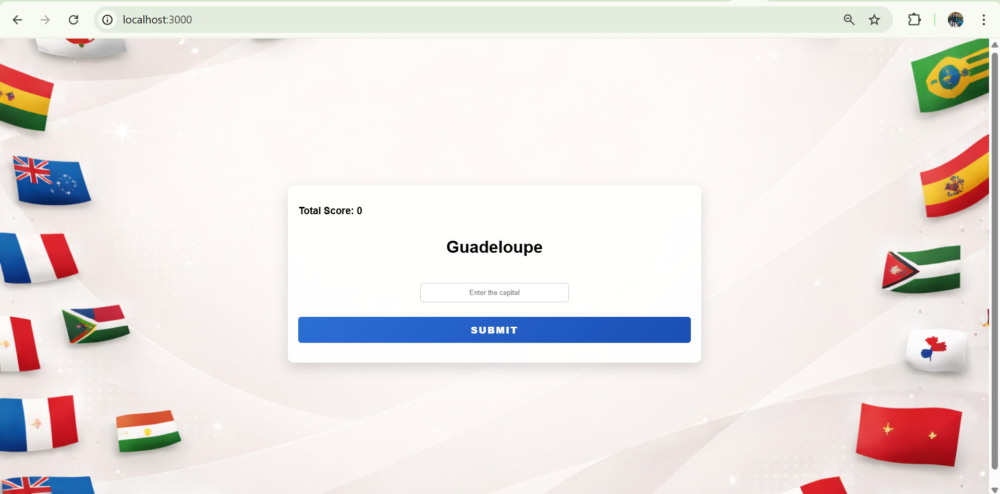

# World Capital Quiz

Worlds + Capital Quiz is an interactive web application designed to test and expand your knowledge of world capitals. Users are presented with a random country and must enter the correct capital city. The app tracks your total score, and a game-over state occurs if you enter an incorrect answer. Built with modern web technologies, it’s a fun, educational challenge for geography enthusiasts.

## Screenshot

## Technologies Used
* Node.js & Express.js
* EJS (Embedded JavaScript)
* PostgreSQL
* HTML/CSS